Unterverband administrieren
======================

In diesem Kapitel werden Funktionen erläutert, um Unterverbände zu verwalten. Diese sind nur für Personen sichtbar oder
zugänglich, welche die entsprechende Gruppenzugehörigkeit und Rolle besitzen.

## Neue Mitglieder erfassen

Um ein neues Mitglied zu erfassen gibt es zwei Möglichkeiten.
Entweder kann das allgemeine Neuregistrierungsformular vom Mitglied selbst, oder auch von einem Verantwortlichen des Untervarbands ausgefüllt werden, oder eine Person mit der Rolle `Administration` in einem Unterverband kann neue Mitglieder direkt in der entsprechenden Mitgliedergruppe hinzufügen.

### Neuregistrierungsformular

Über das [Neuregistrierungsformular](https://db.ejv.ch/de/groups/5/self_registration) vom EJV können beliebige Personen neu registriert werden.
Dies kann entweder vom Neumittglied selbst ausgefüllt werden, oder jemand aus der Verwaltung kann dies auch im Namen des Neumitglieds ausfüllen.

In einem ersten Schritt muss hier nun die Emailadresse der neu zu registrierenden Person eingegeben werden.
Damit prüft Hitobito ob es für diese Person bereits einen Eintrag gibt, oder ob tatsächlich ein neuer Eintrag angelegt werden muss.

Ist die Emailadresse bereits vergeben, kann das Mitglied selbst sich das Passwort zurücksetzen lassen und erhält dadurch eine Email mit welcher es sich einloggen kann. Eine Neuregistration ist in diesem Fall nicht notwendig.
Ist die Emailadresse noch nicht vergeben, kommt man zum zweiten Schritt.
Hier können nun die Personendaten ausgefüllt und das Formular anschliessend abgesendet werden.
Ein Administrator des Eidgenössischen Jodlerverbands wird anschliessend das Neumitglied in die korrekte Gruppe einteilen.

### Neumitglied erfassen

Personen mit der Rolle `Administration` können in ihrem eigenen Unterverein neue Personen erfassen.

Dazu muss zuerst im der Navigation links in die korrekte Gruppe navigiert werden. Dort kann unter dem Menupunkt Personen ein neues Mitglied für diesen Verein erfasst werden.

Damit landet man auf der Maske "Person hinzufügen" zuerst in der Ansicht um eine bestehende Person zu suchen.
Zuerst soll die Person über das Suchfeld mit Namen gesucht werden `1`.

Anhand des Namens wird eine treffende Auswahl der bereits vorhandenen
Mitgliedern mit Wohnort und Jahrgang angezeigt. Falls die gesuchte
Person existiert, ist sie `2`

  - der gewünschten Gruppe,
  - mit entsprechender Rolle,
  - allenfalls einer weiteren Bezeichnung
  - und dem Eintrittsdatum zuzuweisen.

Anschliessend empfiehlt es sich, die Angaben der Person zu prüfen und
gegebenenfalls anzupassen. Hat das Mitglied noch keine
Haupt-E-Mailadresse ist diese für den Login auf die Datenbank
einzusetzen.

Wenn bei der Eingabe des Namens keine Auswahl angezeigt wird, kann
direkt über die Tastatur **Enter** gedrückt, oder auf die Funktion "Neumitglied erfassen" `3` geklickt werden und man gelangt in
die Maske für **Neue Person erfassen**.

Hier müssen mindestens die mit einem Stern markierten Felder ausgefüllt und eine Rolle ausgewählt werden.

Mit `Speichern` wird die Person mit der entsprechenden Rolle angelegt.
Im Anschluss landet man auf dem Profil des Neumitglieds und kann bei Bedarf noch weitere Daten zur Person erfassen.

---
## Adressmutationen

Ist ein Mitglied umgezogen und muss die Adresse geändert werden, so muss zuerst auf die Person navigiert werden.
Dies kann über die globale suche, oder über die Navigation links geschehen.
Mit `Bearbeiten` können anschliessend alle Personendaten angepasst werden.

Werden Adressmutationen noch im **Jahr 2025** vorgenommen, muss der Person anschliessend das Tag `Som-Nov` gegeben werden.

---
## Rollenmutationen

### Rolle innerhalb einer Gruppe ändern
Um einer Person eine andere Rolle innerhalb einer Gruppe zu geben, gibt es mehrere Möglichkeiten.
Am einfachsten kann man dies direkt auf der Personenübersichtder Gruppe vornehmen. 

Dazu klickt man `1` auf Bearbeiten, wählt dann `2` die neue Rolle aus und speichert diese `3`.
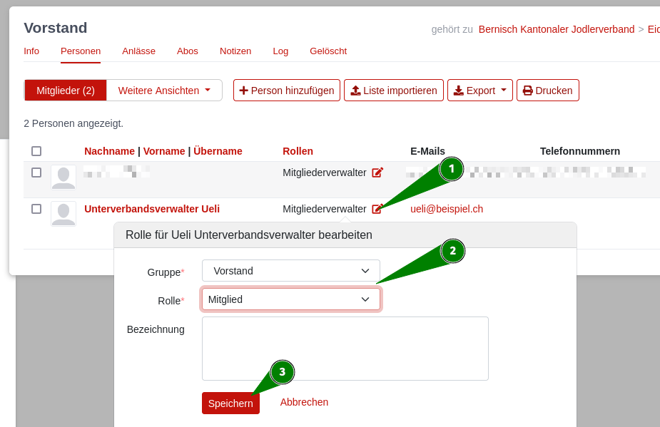
Dadurch wird die alte Rolle per heute beendet. Die neue Rolle hat das gleiche Startdatum wie die bisherige Rolle hatte.

Möchte man ein anderes Startdatum eingeben können, so kann man die Rolle auch direkt auf der Personenübersicht ändern. 
Dazu navigiert man zuerst auf die entsprechende Person und bearbeitet die Rolle direkt auf dieser Ansicht.
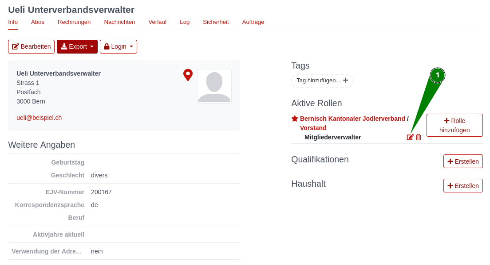
Dabei gelangt man auf eine neue Ansicht in der man `1` die neue Gruppe und Rolle auswählen kann. Anschliessend kann man ein Start und bei Bedarf Enddatum für die Rolle setzen `2`.
Rechts wird einem dabei angezeigt, welche Rechte die neue Rolle haben wird `3`.
Mit Speichern wird dies geändert. Die alte Rolle wird per heute terminiert.
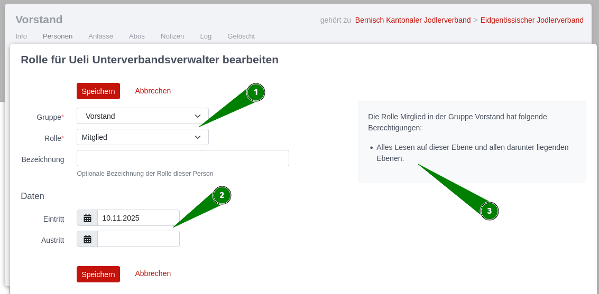

### Neue Rolle in der gleichen Gruppe hinzufügen
Will man einer Person eine neue, zusätzliche Rolle in einer Gruppe geben, navigiert man zuerst auf die Person.
Über den Button Rolle hinzufügen `1` gelangt man auf die Maske um eineneue Rolle anzulegen.
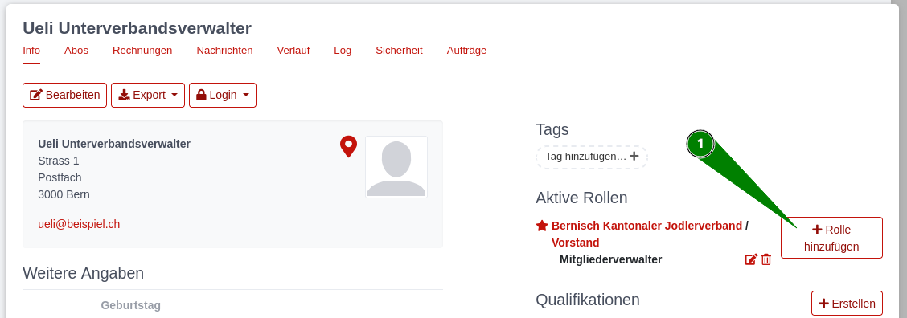
Hier wählt man  `1` die neue Gruppe und Rolle auswählen kann. Anschliessend kann man ein Start und bei Bedarf Enddatum für die Rolle setzen `2`.
Rechts wird einem dabei angezeigt, welche Rechte die neue Rolle haben wird `3`.
Mit Speichern erhält die Person die zusätzliche Rolle. Ist das Startdatum der Rolle in der Zukunft, so ist dies nicht per sofort auf der Person, sondern nur im Verlauf der Person ersichtlich.
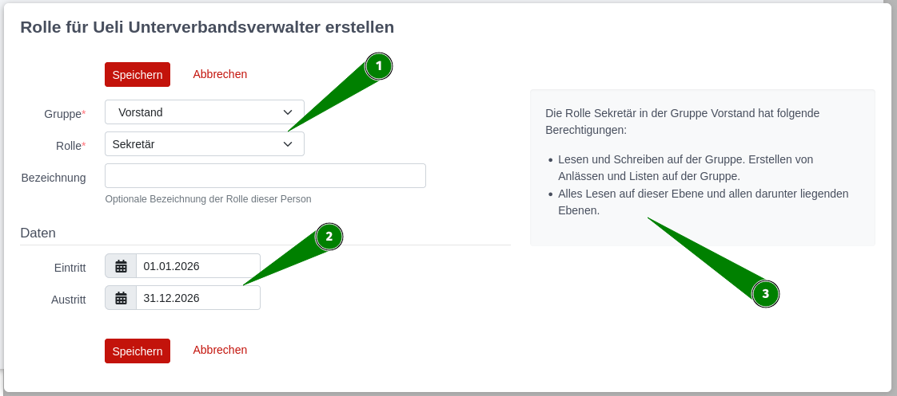

### Neue Rolle in neuer Gruppe
Will man einer Person eine neue Rolle in einer komplett anderen Gruppe geben, so muss man zuerst links in der Übersicht auf die entsprechende Gruppe navigieren `1`. 
Anschliessend kann man im Personen-Tab `2` dieser Gruppe "Person hinzufügen" `3` auswählen.
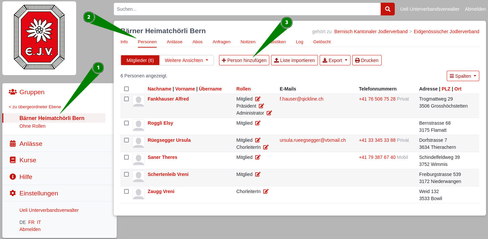
Hier kann man nun die bestehende Person suchen. Dazu gibt man den Namen der Person welche die neue Rolle erhalten soll im Suchfeld `1`ein und wählt die korrekte Person aus.
Anschliessend wählt man auch hier die entsprechende Rolle aus `2` und sieht rechts was die Rolle für Rechte hat. 
Letztlich wählt man Eintritts- und allenfalls Austrittsdatum an `3` und speichert.
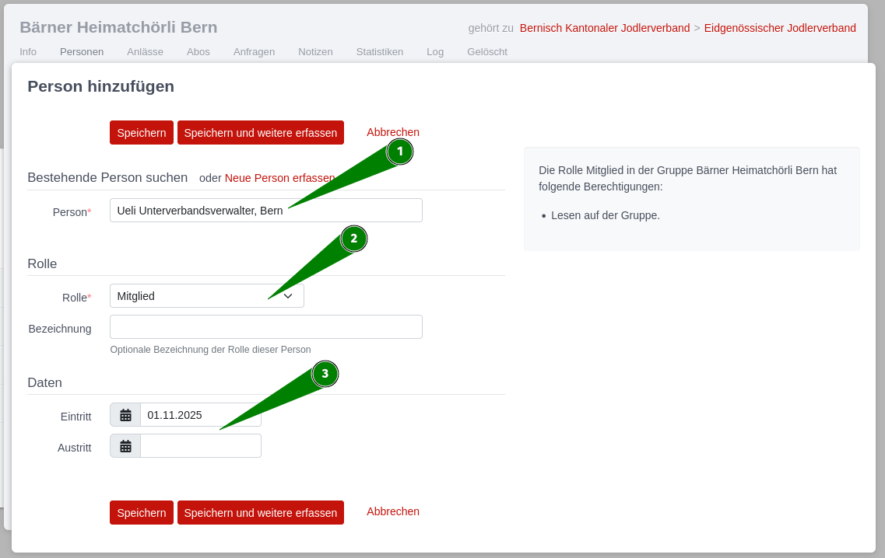

---
## Mitglieder löschen

Personen können durch die Administration eines Unterverbandes nicht komplett gelöscht werden.
Ist eine Person nicht länger Mitglied in einem Verein, wird stattdessen die Rolle in der entsprechenden Gruppe gelöscht.
Dazu navigiert man zuerst auf die Person. Im Info Tab rechts sind alle aktiven Rollen dieser Person ersichtlich.
Mit dem Papierkorb kann nun die Rolleder Person beendet werden.

Hat die Person noch weitere Rollen in anderen Gruppen, so ist sie dort noch immer ersichtlich.
War dies die letzte Rolle einer Person, so erscheint die Person nur noch in der Gruppe `Ohne Rollen`.
Personen in der Gruppe `Ohne Rollen` können nur von Administratoren vom EJV endgültig gelöscht werden.

---
## Mitgliederlisten erstellen und exportieren

### Mitgliederliste einer Gruppe exportieren.
Will man eine Liste sämtlicher Personen in einer Gruppe exportieren, kann man dies einfach in der entsprechenden Gruppe `1` auf der Personenübersicht `2` über den Button "Export" `3` ausführen.

Hier hat man die Auswahl zwischen verschiedenen Exportformaten.
Bei CSV und Excel kann anschliessend ausgewählt werden, ob man die aktuell angezeigten Spalten, eine einfache Adressliste, alle Angaben der Personen oder eine Haushaltsliste in der Personen die im gleichen Haushalt wohnen zusammengefasst werden exportieren will.

Bei sehr grossen Listen kann dies eine gewisse Zeit dauern. 
Der Export wird anschliessend direkt heruntergeladen und auf dem eigenen PC gespeichert.

### Personenliste  erstellen und exportieren
Will man eine Liste von Personen aufrufen welche nicht alle in der gleichen Gruppe sind, jedoch sonnst gewisse gemeinsame Attribute haben, so kann dies über den Personenfilter gemacht werden.
Dazu wird zuerst links auf die Gruppe des Unterverbands navigiert. Hier kann im Tab "Personen" unter "Weitere Ansichten" entweder ein zuvor gespeicherter Filter ausgewählt, oder ein Neuer Filter erstellt werden.
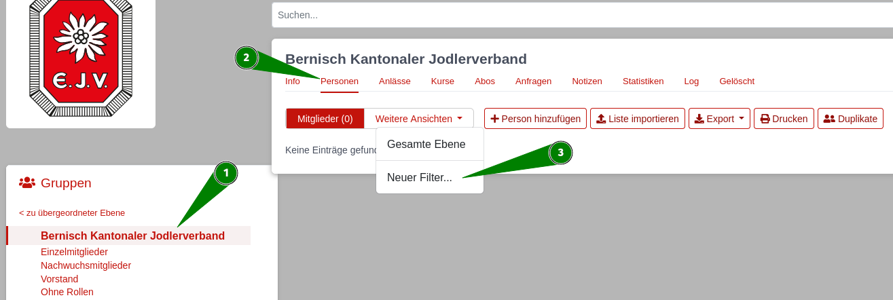

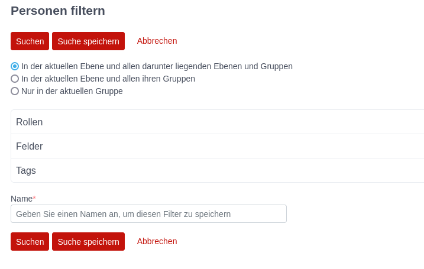

---
## Abos erstellen und verwalten
Hinter den Abos versteckt sich ein mächtiger Personenfilter welcher vielseitig einsetzbar ist.
Mögliche Einsatzgebiete für Abos sind Exporte von Personenlisten, Email-Verteiler, Listen für den Physikalischen Zeitschriftenversand, Rechnungsversand und mehr.
Der Grosse Vorteil von Abos ist dabei, dass diese immer aktuell sind. Meldet sich ein Mitglied neu zu einem Verein an, ist es sofort im Versand der Vereinszeitschrift inkludiert. Übernimmt eine Person ein Amto, oder verliert dieses wieder, ist sie sofort im Versand an alle Personen dieses Amtes inkludiert, und nach Ablauf des Amtes sofort wieder nicht mehr, ohne dass dies mühsam in vielen Mailinglisten nachgeführt werden muss. 

### Abo erstellen
Von Personen mit Leserechten auf einer Gruppe, können für diese und darunterliegende Gruppen Abos erstellt und verwaltet werden.
Dafür geht man auf der obersten Gruppen von welcher man Personen in diesem Abo inkludieren möchte auf den Tab Abos, und wählt "Abo erstellen"

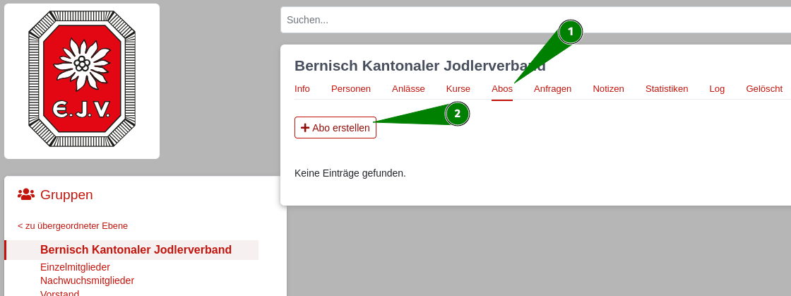

Will man also Beispielsweise leute der ganzen SChweiz inkludieren, muss das Abo auf dem Dachverband erstellt werden. Will man nur Personen von BKJV inkludieren, kann man das abo auf dieser Gruppe erstellen. Man kann abera uch Abos für Lokalgruppen auf einer einzelnen Jodlergruppe erstellen und dann nur Personen dieser Gruppe inkludieren. 

Im Tab Allgemein gibt es die folgenden Einstellungsmöglichkeiten:
- Name: Jedes Abo braucht einen einzigartigen Namen. Dieser wird auch in den Personenprofilen aller dazugehörigen Personen angezeigt, sollte also möglichst eindeutig sein.
- Beschreibung: Optional kann dem Abo eine detailliertere Beschreibung gegeben werden, wofür dieses Abonement verwendet wird.
- Herausgeber: Optionales Feld, welches beim Auswählen neuer Abonements angezeigt wird und beim einordnen des Abos hilfreich sein kann.
- Selbst an/abmelden: Diese Auswahl gibt an, ob sich Personen selbst für dieses Abo an oder abmelden können. Es kann auch ausgewählt werden, ob sich nur die Personen welche ausgewählt werden anmelden dürfen, oder alle Personen in der Hitobito Datenbank.
- Personen sind Standartmässig: Hat man beim oberen Punkt eine der beiden hinteren Optionen ausgewählt, erscheint diese Auswahlmöglichkeit. Angemeldet(opt-out) bedeutet dass die definierten Personen standartmässig alle angemeldet sind, sich jedoch manuell abmelden können. Abgemeldet (opt-out) Bedeutet dass standartmässig keine Personen in dem Abo vorhanden sind, die definierten Personen sich aber manuell zu dem Abo anmelden können.
- 
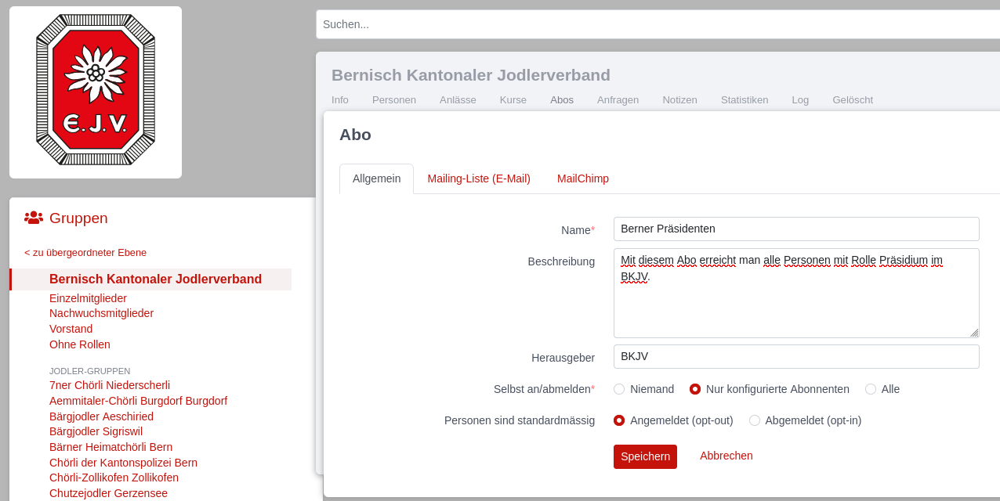

Im Tab Mailing-Liste (Email) gibt es die folgenden Einstellungsmöglichkeiten:
- Mailinglisten Adresse: Versendet man Emails über dieses Abo so ist dies die Absenderadresse welche die betreffenden Personen sehen.
- Zusätzlicher Absender: Müssen einzelne, weitere Personen als nur Personen mit Schreibrechte auf dieser Gruppe auch über dieses Abo Emails versenden können, können die entsprechenden Emailadressen hier eingetragen werden.
- Bevorzugte E-Mail-Labels: Möchte man den Versand bevorzugt an bestimmte Emailadressen machen, kann man dies hier definieren. Es kann auch definiert werden, dass der Versand nur an die Haupt E-Mail_Adresse erfolgt, unabhängig davon ob noch weitere Versandadressen auf den Personen vorhanden sind.
- Abonnenten dürfen auf die Mailingliste schreiben: Ist dieser Punkt angewählt, dürfen alle Empfänger der Abo-Liste auch selbst auf diese schreiben. Bei vielen Empfänger wird davon eher abgeraten.
- Beliebige Absender/-innen dürfen auf die Mailingliste schreiben: Ist dieser Punkta ngewählt dürfen beliebige Absender an den Abo-Verteiler schreiben. Ausser bei sehr spezifischen Usecases wird davon klar abgeraten.
- E-Mail mit Bestätigung an Absender schicken: Ist dies angewählt, erhält der Absender einer Email eine Bestätigung nachdem alle Emails versendet wurden.

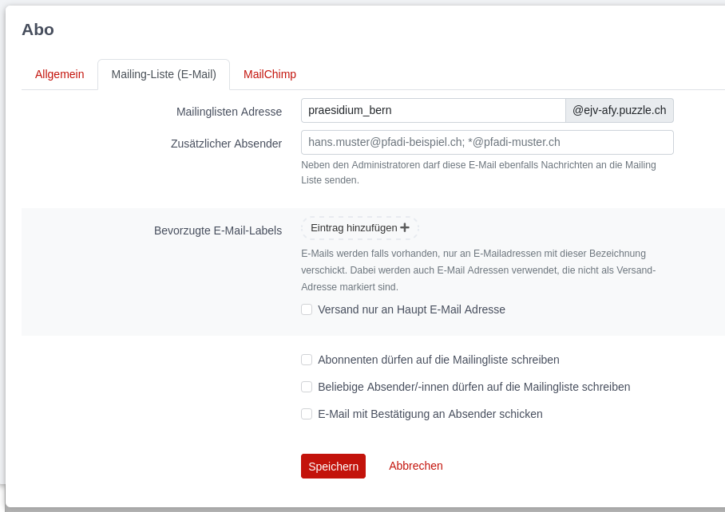

Im Tab MailChimp gibt es Einstellungsmöglichkeiten falls die Adresslisten dieses Abonements mit einem bestehenden Mailchimp Konto Synchronisiert werden sollen.
- Sowohl die MailChimp Listen-ID wie auch der MailChimp API-Schlüssel bekommt man direkt von Mailchimp.
- Jede MailChimp Liste kann nur auf genau ein Abo in Hitobito gemappt werden.

### Abonennten definieren
Hat man ein Abonement erstellt, kann nach dem Speichern im Tab "Abonennten" definiert werden, wer in diesem Abonemment inkludiert werden soll 

- **Personen hinzufügen:** Hier kann eine Einzelperson hinzugefügt werden. Dies macht nur Sinn, wenn eine spezifische Person welche die sonnstigen Auswahlkriterien sonnst nicht erfüllt ebenfalls im Abo aufgenommen werden soll.
- **Gruppen/Rollen hinzufügen:** Hier kann nach einer Gruppe gesucht werden. Am besten sucht man hier nach der obersten Gruppe von der man Personen inkludieren will. Es erscheint anschliessend eine Auswahl aller Rollentypen in dieser Gruppe und deren Untergruppen. Hier kann definiert werden, soll ein Abo alle Personen einer bestimmten Rolle inkludieren. Zusätzlich können hier auch Personen mit bestimmten **Tags** inludiert oder exkludiert werden. Dabei können auch mehrere Tags miteinander kombiniert werden. 
- **Anlass Hinzufügen:** Möchte man in einem Abo automatisch alle Personen eines bestimmten Anlasses inkludieren, kann man hier diesen Anlass auswählen.
- **Personen ausschliessen:** Damit können Einzelpersonen die sonnst alle Kriterien erfüllen trotzdem ausschliessen.
- **Globale Bedingungen:** Hier kann fast jedes Feld in Hitobito gesucht und gefiltert werden. Beispielsweise kann nach bestimmten Sprachen, Geschlecht, Alter, Wohnort und vielem mehr gefiltert werden.

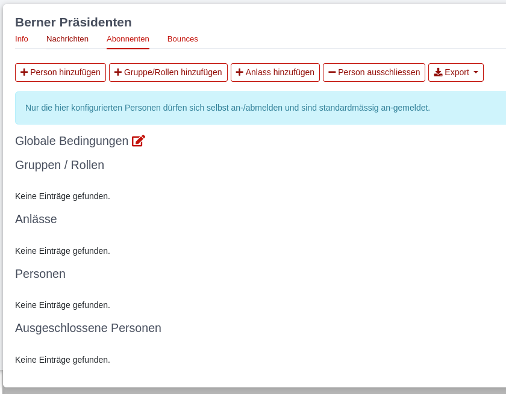

### Abos verwenden:
Ist ein Abo einmal eingerichtet kann es vielseitig verwendet werden.
Der grosse Vorteil von Abos ist dabei, dass sie immer aktuell sind. 
Hat sich ein Mitglied vor Minuten neu angemeldet, erhält es den Versand an alle Mitglieder sofort. Hat jemand die Rolle Präsidium kürzlich verloren, erhält er den Präsidiums-Versand automatisch nicht mehr, ohne dass irgendwelche Mailinglisten angepasst werden müssen.

- **Email Versenden:** Will man ein Email an alle Personen im Abo versenden, so kann man dieses Email im eigenen Mailprogramm erstellen. Man sendet dieses dann an die Mailingliste. Diese verteilt das Email an alle Abonennten. Die Mailingliste findet man im Abo auf dem Tab Info.
- **Rechnungen versenden:** Rechnungen an alle Abonennten können über das Tab "Abonnenten" versendet werden.
- **Export von Personenlisten:** Eine Liste aller Abonnenten kann über das Tab "Abonnenten" exportiert werden.
- **Serienbrief:** Im Tab "Nachrichten" kann ein Serienbrief erstellt und anschliessend als PDF gedruckt werden.
- **Rechnungsbrief erstellen:** Hier können Briefe, mit einer zugehörigen Rechnung erstellt werden. Dies sieht gleich aus wie ein Brief, hat jedoch auch einen Einzahlungsschein.
- **SMS-Versand:** Falls konfiguriert kann über das Tab "Nachrichten" SMS versendet werden.

### Nachrichten und Bounces
Im Tab **Nachrichten** eines Abonennts, sieht man sämtliche Versände über dieses Abonennt. Dies beinhaltet Mailversände, Briefe, Rechnungsbrief und SMS. Aber nicht Rechnungen. Diese sind weiterhin nur für Personen mit Rechnungsberechtigungen im Rechnungsmenu selbst ersichtlich.
Im Tab **Bounces** ist ersichtlich, falls Emails aus diesem Abo nicht zustellbar waren. Erhält man auf einen Mailversand ein Email-Bounce so ist hier ersichtlich bei welchen Personen dies geschehen ist, und die die Mails entsprechend vermtlich nicht erhalten haben.

---
## Anlässe erstellen und verwalten

\-tbd-

---
## Kurse erstellen und verwalten

\-tbd-

---
## Rechnungen

In Hitobito können Debitoren verwaltet, Rechnungen erstellt und Zahlungen verbucht werden. Hitobito hat keine Buchhaltungsfeatures. Bei Bedarf können die Rechnungs- und Zahlungsdaten exportiert, oder eine Buchhaltungssoftware via Schnittstellen angebunden werden.
Ob eine Person Rechnungen verwalten kann hängt davon ab, ob sie eine entsprechende Rolle hat. Welche Rollen `:finance` Berechtigungen haben hängt von der jeweiligen Organisation ab.

### Rechnungseinstellungen
--------------------------
In den Rechnungseinstellungen werden pro Ebene gültige Angaben gemacht. Hier werden die allgemeinen Rechnungseinstellungen verwaltet und Mahnungsfristen und -texte definiert. Zudem können Einstellungen zum Email-Versand und Rechnungslayout vorgenommen werden, sowie Zahlungsschnittstellen eingerichtet werden.

.. image:: images/AnsichtRechnung.png

Hinweis: Damit Rechnungen versendet werden können müssen gültige Rechnungseinstellungen vorhanden sein.

### Rechnungsartikel
---------------------------------------
Häufig verwendete Rechnungspositionen (z.B. Mitgliederbeitrag, Jahresabo, etc.) können hier pro Ebene vordefiniert werden. Diese Artikel können beim Erstellen von Rechnungen ausgewählt und individuell angepasst werden.

.. image:: images/Rechnungsartikel.png

Hinweis: Die Felder Kostenstelle und Konto haben in Hitobito keine Funktion. Sie sind lediglich für einen allfälligen Export in eine Buchhaltungssoftware vorhanden.

### Rechnungen erstellen
--------------------------------------
Rechnungen werden nicht auf der Ansicht Rechnungen erstellt, sondern ausgehend von Personenlisten oder einer bestimmten Person.

Rechnungen können aus folgenden Ansichten erstellt werden:

- Personenlisten in einer **Gruppe**. Erstellt eine Einzelrechnung an die ausgewählten Personen.
- Teilnehmerlisten von einem **Event**. Erstellt eine Einzelrechnung an die ausgewählten Personen.
- Auf dem Profil einer **Einzelperson**. Erstellt eine Einzelrechnung an die ausgewählte Person.
- In einem **Abo**. Erstellt einen Rechnungslauf an die jeweiligen Empfänger des Abos.
- **Externe Rechnungen** erstellen in der Übersicht Einzelrechnungen. Erstellt eine Einzelrechnung. Diese wird keiner Person in Hitobito zugeordnet.

### Rechnungen einsehen und bearbeiten
--------------------------------------

Rechnungen können in der Übersicht „Rechnungen“ eingesehen und bearbeitet werden. Hier wird zwischen Einzelrechnungen und Rechnungsläufen unterschieden.

Rechnungen können gestellt, gemahnt und per Email versendet werden. Dabei werden immer sämtliche ausgewählten Rechnungen gestellt oder gemahnt abhängig von ihrem aktuellen Status.

Hier können Rechnungen auch gedruckt oder exportiert werden, und es können Zahlungen erfasst werden.

Rechnungen werden in der Übersicht zusätzlich pro Rechnungslauf zusammengefasst. Dabei wird die Anzahl Empfänger, so wie die Anzahl und der Betrag der bezahlten Rechnungen angezeigt.

Die Rechnungen einer spezifischen Person können auch auf der jeweiligen Personenansicht eingesehen werden.

### Zahlungen Erfassen
---------------------------------------
Zahlungen können auf drei verschiedene Arten erfasst werden.

Auf jeder Einzelrechnung können manuelle Zahlungen für die jeweilige Rechnung erfasst werden.

In der Übersicht Einzelrechnungen können camt.54 XML-Datei hochgeladen werden. Diese erfassen die jeweiligen Zahlungen auf den dazugehörigen Rechnungen. Die Zahlungen werden auch erfasst, wenn es sich dabei um einen Rechnungslauf handelt.

Ist in den Rechnungseinstellungen eine Zahlungsschnittstelle eingerichtet, werden die Zahlungen nächtlich über die EBICS Schnittstelle mit der Bank abgeglichen.
Anleitung zum einrichten der EBICS Schnittstelle: https://hitobito.readthedocs.io/de/latest/ebics.html

### Buchungsbeleg
---------------------------------------
Unter Buchungsbeleg wird eine rudimentäre Übersicht über die eingegangenen Zahlungen gegeben. Diese werden nach Rechnungsartikel sortiert. Dabei wird davon ausgegangen, dass gleiche Rechnungsartikel auch immer den gleichen Betrag aufweisen. 

### Häufig gestellte Fragen:
---------------------------------------
Q1: Ich kann keine Rechnungen stellen oder Zahlungen erfassen. Wenn ich auf den Button "Rechnung erstellen" oder "Zahlung erfassen" klicke, geschieht nichts.

A1: Die Rechnungseinstellungen sind ungültig. Dafür unter "Rechnungen" auf "Einstellungen" klicken und dort folgendes anpassen:
Unter "Einzahlung für" die Daten aus "Alter Zahlungsempfänger" in die untenstehenden Pflichfelder eintragen. Danach speichern.

.. image:: images/Rechnungseinstellungen.png

Q2: Ich kann keine Rechnungen erstellen. Die Gruppe als welche ich Rechnungen stellen mögcht ist ausgegraut.

A2: Für die ausgegraute Gruppe sind keine gültigen Rechnungseinstellungen vorhanden. Bitte aktuallisiere die Rechnungseinstellungen.

Q3: Ich kann meine Rechnungseinstellungen nicht speichern? 

A3: Vermutlich ist in einem anderen Tab der Rechnungseinstellungen noch eine falsche Information vorhanden. Probiere auf den verschiedenen Tabs die Rechnungseinstellungen zu speichern.

Q4: Ich kann eine Rechnung nicht mehr löschen?

A4: Eine Rechnung kann nur gelöscht werden, solange sie noch den Status "Entwurf" hat. Ein Rechnungslauf kann nur gelöscht werden, wenn noch alle darin enthaltenen Rechnungen den Status "Entwurf" haben. Hat eine Rechnung bereits einen anderen Status, kann diese nur noch storniert werden.

Q5: Eine Rechnung mit dem Status "Gestellt" wird nicht gemahnt, obwohl ich diese bei Mahnen ausgewählt hatte.

A5: Rechnungen werden nur gemahnt, wenn das Mahndatum erreicht wird. Sschaue in den Rechnungseinstellungen nach, wie lange nach Rechnungsdatum hier die Mahnfrist ist.

Q6: Nach dem Speichern meines Rechnungslaufs werden keine Rechnungen erstellt.

A6: Damit Rechnungsläufe erfolgreich erstellt werden können, muss mindestens eine Rechnungspositon einen Betrag aufweisen (Dieser Betrag kann 0 sein).

---
## SUISA

\-tbd-

---
## Modul Hilfe

### Hilfetext

Die Texte können in den drei Landessprachen Deutsch, Französisch und
Italienisch erfasst werden. Um einen Text zu übersetzen, muss zuerst die
Sprache (unten links) geändert werden und dann der Text übersetzt
werden.

Die Hilfetexte sind global (Stufe hitobito\!)

