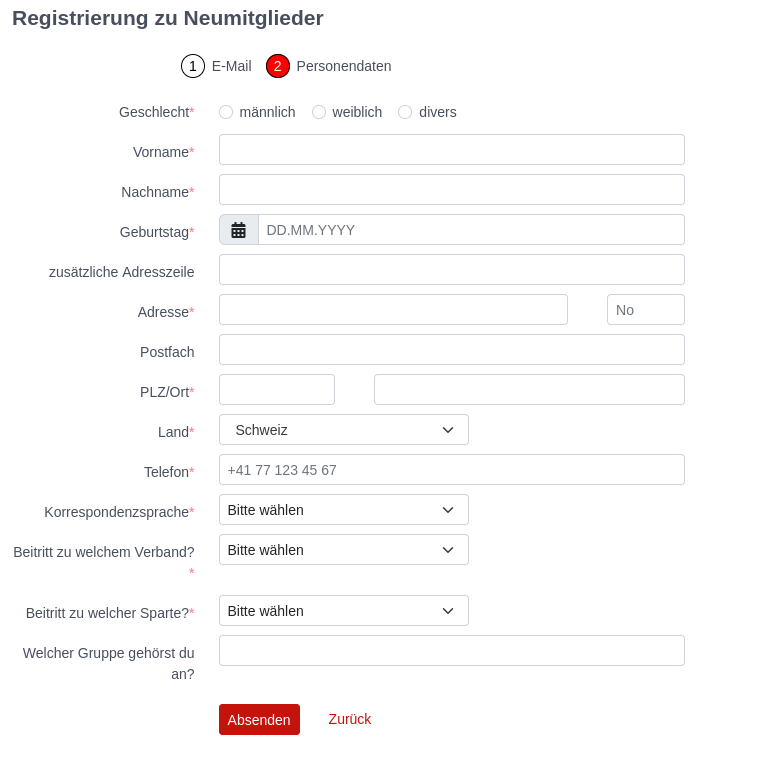
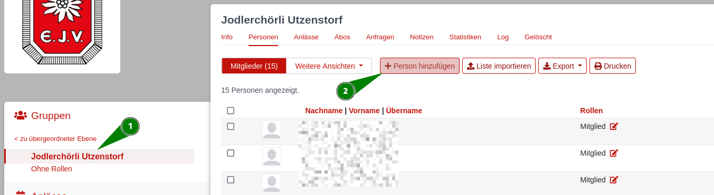
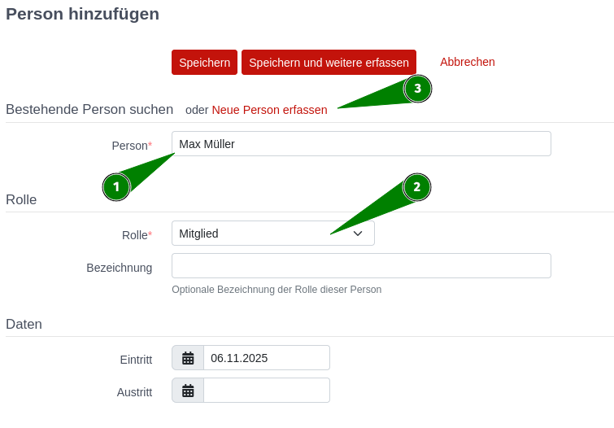
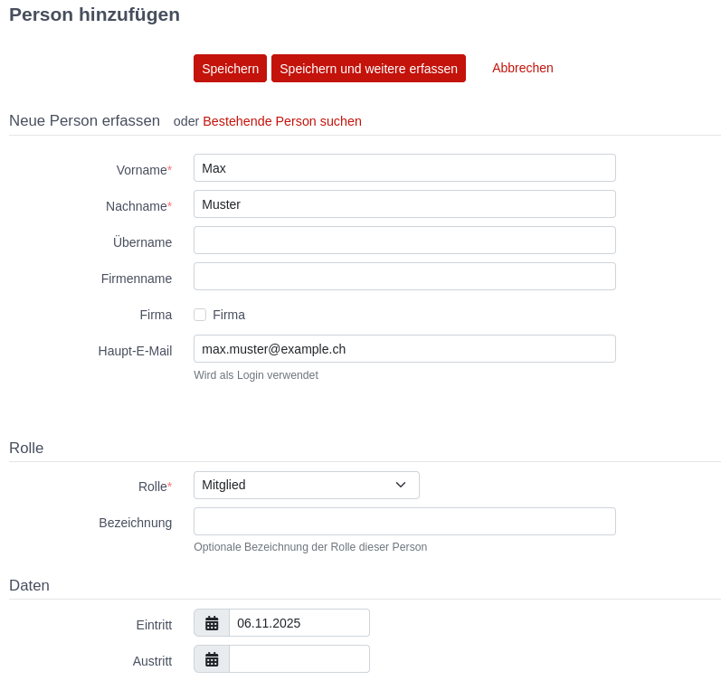
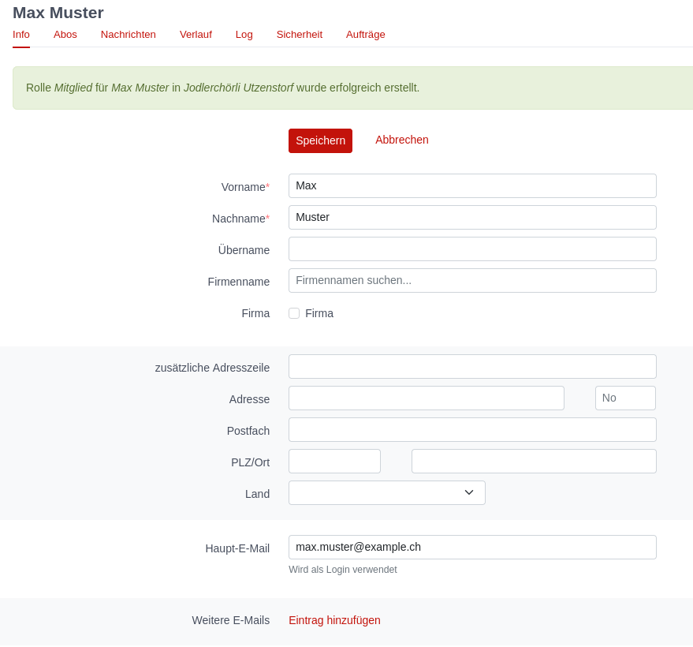
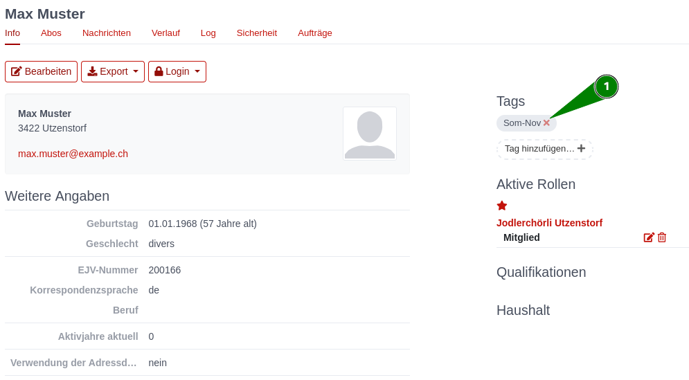
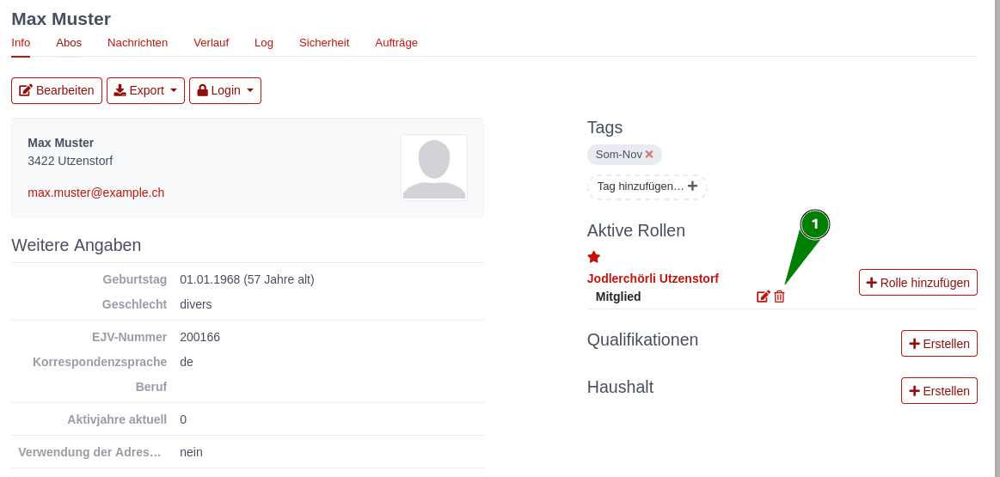
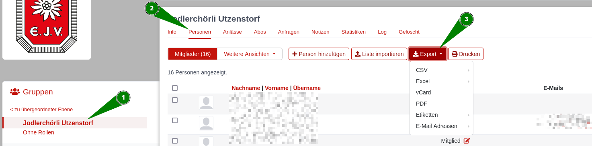

Verband administrieren
======================

In diesem Kapitel werden Funktionen erläutert, um Regionalverbände zu verwalten. Diese sind nur für Personen sichtbar oder
zugänglich, welche die entsprechende Gruppenzugehörigkeit und Rolle besitzen.

## Neue Mitglieder erfassen

Um ein neues Mitglied zu erfassen gibt es zwei Möglichkeiten.
Entweder kann das allgemeine Neuregistrierungsformular vom Mitglied selbst, oder auch von einem Verantwortlichen des Untervarbands ausgefüllt werden, oder eine Person mit der Rolle `Administration` in einem Unterverband kann neue Mitglieder direkt in der entsprechenden Mitgliedergruppe hinzufügen.

### Neuregistrierungsformular

Über das [Neuregistrierungsformular](https://db.ejv.ch/de/groups/5/self_registration) vom EJV können beliebige Personen neu registriert werden.
Dies kann entweder vom Neumittglied selbst ausgefüllt werden, oder jemand aus der Verwaltung kann dies auch im Namen des Neumitglieds ausfüllen.

In einem ersten Schritt muss hier nun die Emailadresse der neu zu registrierenden Person eingegeben werden.
Damit prüft Hitobito ob es für diese Person bereits einen Eintrag gibt, oder ob tatsächlich ein neuer Eintrag angelegt werden muss.

Ist die Emailadresse bereits vergeben, kann das Mitglied selbst sich das Passwort zurücksetzen lassen und erhält dadurch eine Email mit welcher es sich einloggen kann. Eine Neuregistration ist in diesem Fall nicht notwendig.
Ist die Emailadresse noch nicht vergeben, kommt man zum zweiten Schritt.
Hier können nun die Personendaten ausgefüllt und das Formular anschliessend abgesendet werden.
Ein Administrator des Eidgenössischen Jodlerverbands wird anschliessend das Neumitglied in die korrekte Gruppe einteilen.

### Neumitglied erfassen

Personen mit der Rolle `Administration` können in ihrem eigenen Unterverein neue Personen erfassen.

Dazu muss zuerst im der Navigation links in die korrekte Gruppe navigiert werden. Dort kann unter dem Menupunkt Personen ein neues Mitglied für diesen Verein erfasst werden.

Damit landet man auf der Maske "Person hinzufügen" zuerst in der Ansicht um eine bestehende Person zu suchen.
Zuerst soll die Person über das Suchfeld mit Namen gesucht werden `1`.

Anhand des Namens wird eine treffende Auswahl der bereits vorhandenen
Mitgliedern mit Wohnort und Jahrgang angezeigt. Falls die gesuchte
Person existiert, ist sie `2`

  - der gewünschten Gruppe,
  - mit entsprechender Rolle,
  - allenfalls einer weiteren Bezeichnung
  - und dem Eintrittsdatum zuzuweisen.

Anschliessend empfiehlt es sich, die Angaben der Person zu prüfen und
gegebenenfalls anzupassen. Hat das Mitglied noch keine
Haupt-E-Mailadresse ist diese für den Login auf die Datenbank
einzusetzen.

Wenn bei der Eingabe des Namens keine Auswahl angezeigt wird, kann
direkt über die Tastatur **Enter** gedrückt, oder auf die Funktion "Neumitglied erfassen" `3` geklickt werden und man gelangt in
die Maske für **Neue Person erfassen**.

Hier müssen mindestens die mit einem Stern markierten Felder ausgefüllt und eine Rolle ausgewählt werden.

Mit `Speichern` wird die Person mit der entsprechenden Rolle angelegt.
Im Anschluss landet man auf dem Profil des Neumitglieds und kann bei Bedarf noch weitere Daten zur Person erfassen.

## Adressmutationen

Ist ein Mitglied umgezogen und muss die Adresse geändert werden, so muss zuerst auf die Person navigiert werden.
Dies kann über die globale suche, oder über die Navigation links geschehen.
Mit `Bearbeiten` können anschliessend alle Personendaten angepasst werden.

Werden Adressmutationen noch im **Jahr 2025** vorgenommen, muss der Person anschliessend das Tag `Som-Nov` gegeben werden.

## Mitglieder löschen

Personen können durch die Administration eines Unterverbandes nicht komplett gelöscht werden.
Ist eine Person nicht länger Mitglied in einem Verein, wird stattdessen die Rolle in der entsprechenden Gruppe gelöscht.
Dazu navigiert man zuerst auf die Person. Im Info Tab rechts sind alle aktiven Rollen dieser Person ersichtlich.
Mit dem Papierkorb kann nun die Rolleder Person beendet werden.

Hat die Person noch weitere Rollen in anderen Gruppen, so ist sie dort noch immer ersichtlich.
War dies die letzte Rolle einer Person, so erscheint die Person nur noch in der Gruppe `Ohne Rollen`.
Personen in der Gruppe `Ohne Rollen` können nur von Administratoren vom EJV endgültig gelöscht werden.

## Mitgliederlisten erstellen und exportieren

### Mitgliederliste einer Gruppe exportieren.
Will man eine Liste sämtlicher Personen in einer Gruppe exportieren, kann man dies einfach in der entsprechenden Gruppe `1` auf der Personenübersicht `2` über den Button "Export" `3` ausführen.

Hier hat man die Auswahl zwischen verschiedenen Exportformaten.
Bei CSV und Excel kann anschliessend ausgewählt werden, ob man die aktuell angezeigten Spalten, eine einfache Adressliste, alle Angaben der Personen oder eine Haushaltsliste in der Personen die im gleichen Haushalt wohnen zusammengefasst werden exportieren will.

Bei sehr grossen Listen kann dies eine gewisse Zeit dauern. 
Der Export wird anschliessend direkt heruntergeladen und auf dem eigenen PC gespeichert.

### Personenliste exportieren

## Abos erstellen und verwalten

\-tbd-

## Anlässe erstellen und verwalten

\-tbd-

## Kurse erstellen und verwalten

\-tbd-

## Rechnungen

\-tbd-

## SUISA

\-tbd-

## Modul Hilfe

### Hilfetext

Die Texte können in den drei Landessprachen Deutsch, Französisch und
Italienisch erfasst werden. Um einen Text zu übersetzen, muss zuerst die
Sprache (unten links) geändert werden und dann der Text übersetzt
werden.

Die Hilfetexte sind global (Stufe hitobito\!)

